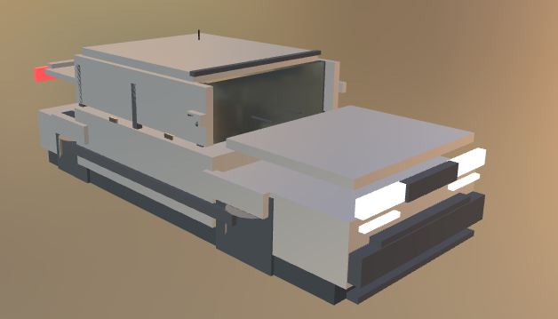
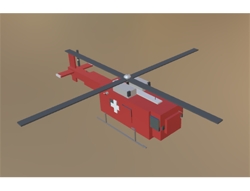
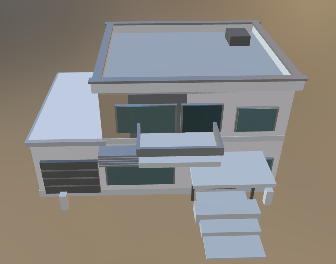
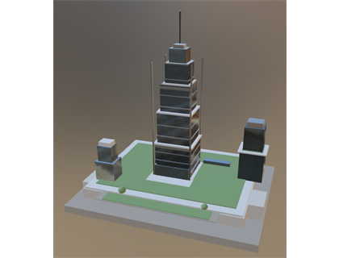
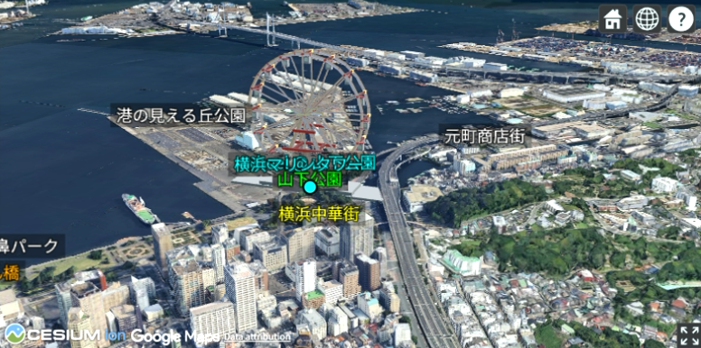
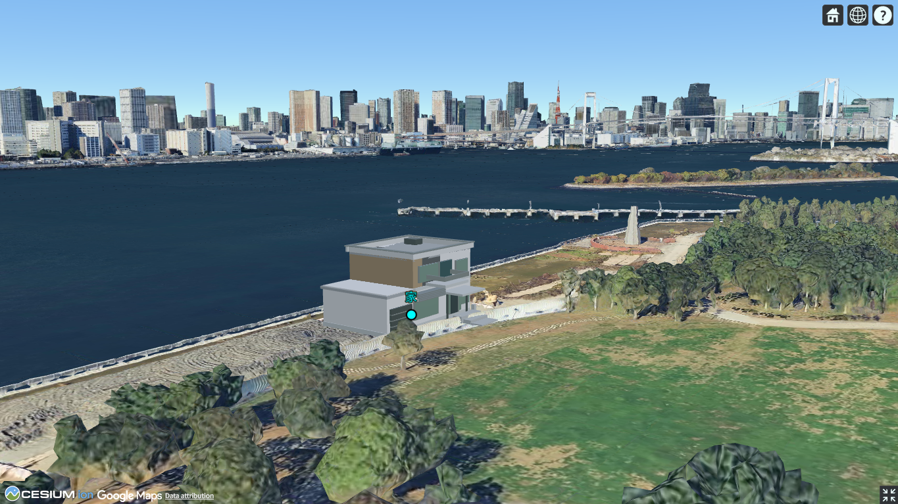

# prompt2gltf / prompt2cesiumjs Skills

このリポジトリは 2 つのローカルスキルを提供します。

| スキル | 概要 |
|---|---|
| `prompt2gltf` | 自然言語のプロンプトから 3D 仕様 JSON を生成し、`gltf/glb` を出力する |
| `prompt2cesiumjs` | 自然言語のプロンプトから 3D 仕様のマップを表示させるため、Cesium Sandcastle 用 JavaScript を生成する |

---

## prompt2gltf

### このスキルでできること

- ユーザーのプロンプトを解釈して、subject・スケール・スタイル・形状方針を推定
- 高密度な `spec.json` を生成
- `model.gltf` と `model.glb` を生成

---

### 使い方

#### 事前準備

##### 1. Node.js のインストール

このスキルは **Node.js (v18 以上)** が必要です。

1. [Node.js 公式サイト](https://nodejs.org/) にアクセスし、**LTS 版**をダウンロードしてインストールしてください。
2. インストール後、ターミナル（PowerShell / コマンドプロンプト / Git Bash）で以下を実行して確認します。

   ```bash
   node --version
   ```

   `v18.x.x` 以上が表示されれば OK です。

##### 2. 依存パッケージのインストール

プロジェクトルートで以下を実行してください。

```bash
cd plugins/prompt2gltf
npm install
```

> `node_modules/` フォルダが作成されれば成功です。

##### 3. (任意) Claude Code のインストール

このスキルは Claude Code のスキル機能（`/prompt2gltf`）から呼び出すことを前提にしています。
Claude Code をまだインストールしていない場合は、以下を参照してください。

- [Claude Code 公式ページ](https://claude.ai/claude-code)
- インストール後、プロジェクトルートで `claude` コマンドを実行するだけで使えます。

---

#### 実行方法

##### Claude Code スキルから呼び出す（推奨）

Claude Code を起動した状態で、チャット欄に以下のように入力します。

```
/prompt2gltf 観覧車を作って
/prompt2gltf 病院を作って
/prompt2gltf 2階建てアパートを作って
/prompt2gltf 100m級の巨人を作って
```

スキルが自動的にプロンプトを解釈し、生成ロジックを呼び出します。

##### コマンドラインから直接実行

```bash
node plugins/prompt2gltf/scripts/index.mjs --prompt "ここにプロンプト"
```

例:

```bash
node plugins/prompt2gltf/scripts/index.mjs --prompt "警察署"
node plugins/prompt2gltf/scripts/index.mjs --prompt "消防士"
node plugins/prompt2gltf/scripts/index.mjs --prompt "看護師"
node plugins/prompt2gltf/scripts/index.mjs --prompt "3階建て学校"
node plugins/prompt2gltf/scripts/index.mjs --prompt "市役所"
node plugins/prompt2gltf/scripts/index.mjs --prompt "2階建てアパート"
```

---

### 出力先

出力はすべて次のディレクトリに保存されます。

```
plugins/prompt2gltf/generated/
```

| ファイル | 内容 |
|---|---|
| `model_spec.json` | 高密度な 3D 仕様 JSON |
| `model.gltf` | GLTF 形式の 3D モデル |
| `model.glb` | GLB (バイナリ) 形式の 3D モデル |

---

### 対応カテゴリ

#### 建物・施設

| カテゴリ | 例 |
|---|---|
| `building` (一般建築) | 戸建て、アパート、マンション、大邸宅 |
| `facility_hospital` (病院・診療所) | 病院、診療所、クリニック |
| `facility_police` (警察署) | 警察署 |
| `facility_fire` (消防署) | 消防署 |
| `facility_nursing` (老人ホーム) | 老人ホーム、介護施設 |
| `facility_school` (学校) | 小学校、中学校、高校 |
| `facility_cityhall` (市役所) | 市役所、区役所、町役場 |
| `campus` (キャンパス) | 大学、キャンパス |

#### 人物

| カテゴリ | 例 |
|---|---|
| `human` (人間全般) | 大人、女性、男性 |
| `police_officer` (警察官) | 警察官、警官 |
| `firefighter` (消防士) | 消防士 |
| `nurse` (看護師) | 看護師 |
| `doctor` (医師) | 医師、ドクター |
| `child` (子ども) | 子ども、子供、小学生 |
| `elderly` (老人) | 老人、高齢者 |

#### その他

| カテゴリ | 例 |
|---|---|
| `vehicle` | 鉄道、自動車、パトカー、航空機、船 |
| `castle` | 魔王城、シンデレラ城、日本の城 |
| `structure` | 木、信号、歩道橋、橋、データセンター |
| `giant` | 巨人、モアイ |
| `robot` | ロボット、メカ |
| `tower` | タワー、スカイツリー |
| `airship` | 飛行船 |
| `kaiju` | 怪獣 |
| `warrior` | 戦士、騎士 |

---

### モデリング方針

- `box` だけでなく `cylinder` / `sphere` / `tri_prism` を併用
- 丸みのある対象は曲面プリミティブで形状を反映
- JSON の情報量（parts / details の密度）は落とさない
- 施設建物には施設固有の構造物（十字マーク・サイレン灯・大扉・ポルティコ）を追加
- 人物モデルは骨格プロポーションに基づいた多パーツ構成

---

### 主なファイル（prompt2gltf）

| ファイル | 役割 |
|---|---|
| `plugins/prompt2gltf/.claude-plugin/plugin.json` | プラグイン定義 |
| `plugins/prompt2gltf/skills/prompt2gltf/SKILL.md` | スキル定義（Claude Code が読む） |
| `plugins/prompt2gltf/scripts/index.mjs` | 生成ロジック本体 |
| `plugins/prompt2gltf/templates/` | テンプレート spec JSON 置き場 |
| `plugins/prompt2gltf/package.json` | npm 設定 |
| `plugins/prompt2gltf/generated/` | 生成物の出力先 |

---

## prompt2cesiumjs

### このスキルでできること

- ユーザーの自然文指示から Cesium Sandcastle 用 JavaScript を生成
- 生成したコードは [Cesium Sandcastle](https://sandcastle.cesium.com/) にそのまま貼り付けて実行可能
- Google Photorealistic 3D Tiles を使用したリアルな 3D マップ上でモデルを表示
- 対象とする`gltf/glb`はgithub等のurlが取得できる場所へ事前に保存することが必要

生成できるコードの種類:

| モード | 概要 |
|---|---|
| `walk_follow` | ルートに沿って人型モデルが歩き、後方追尾カメラで追う |
| `drone_follow` | ルートに沿ってモデルが移動し、ドローン視点（上空から）で追う |
| `place_model` | 3D マップ上の指定座標に glTF / glb モデルを固定配置する |

---

### 使い方

#### Claude Code スキルから呼び出す（推奨）

```
/prompt2cesiumjs 虎ノ門ヒルズから東京タワーまで歩くコード、https://github.com/KickboxerJ0322/Prompt2GLTF/blob/master/glb/businessman.glb
/prompt2cesiumjs 渋谷駅から原宿駅まで少し上から追尾、https://github.com/KickboxerJ0322/Prompt2GLTF/blob/master/glb/heli.glb
/prompt2cesiumjs 豊洲ぐるり公園に 家を置く Sandcastle コード、https://github.com/KickboxerJ0322/Prompt2GLTF/blob/master/glb/house.glb
```

スキルがモードを自動判定し、テンプレートをベースにコードを生成します。

---

### 出力先

```
plugins/prompt2cesiumjs/generated/
```

| ファイル | 内容 |
|---|---|
| `sandcastle.js` | Cesium Sandcastle に貼り付けて実行する JavaScript |

---

### モード選択ルール

| モード | 選択される語句の例 |
|---|---|
| `walk_follow` | 後ろから追尾、歩く、散歩、ルートに沿って移動 |
| `drone_follow` | ドローン視点、少し上から、上空から、上から追尾 |
| `place_model` | gltf を地図に置く、固定配置、建物モデルを設置、移動しないモデル |

---

### 主なファイル（prompt2cesiumjs）

| ファイル | 役割 |
|---|---|
| `plugins/prompt2cesiumjs/.claude-plugin/plugin.json` | プラグイン定義 |
| `plugins/prompt2cesiumjs/skills/prompt2cesiumjs/SKILL.md` | スキル定義（Claude Code が読む） |
| `plugins/prompt2cesiumjs/templates/sandcastle_walk_follow.js` | 後方追尾移動テンプレート |
| `plugins/prompt2cesiumjs/templates/sandcastle_drone_follow.js` | ドローン追尾移動テンプレート |
| `plugins/prompt2cesiumjs/templates/sandcastle_place_model.js` | 固定配置テンプレート |
| `plugins/prompt2cesiumjs/presets/tokyo_routes.json` | 東京ルートプリセット |
| `plugins/prompt2cesiumjs/generated/sandcastle.js` | 生成物の出力先 |

---

## リポジトリ共通ファイル

| ファイル | 役割 |
|---|---|
| `.claude-plugin/marketplace.json` | プラグイン一覧（ハッカソン用マーケットプレイス定義） |

---

## 出力結果（サマリー）








---

## 動画

[](https://www.youtube.com/watch?v=Irw6JqgXudk)
